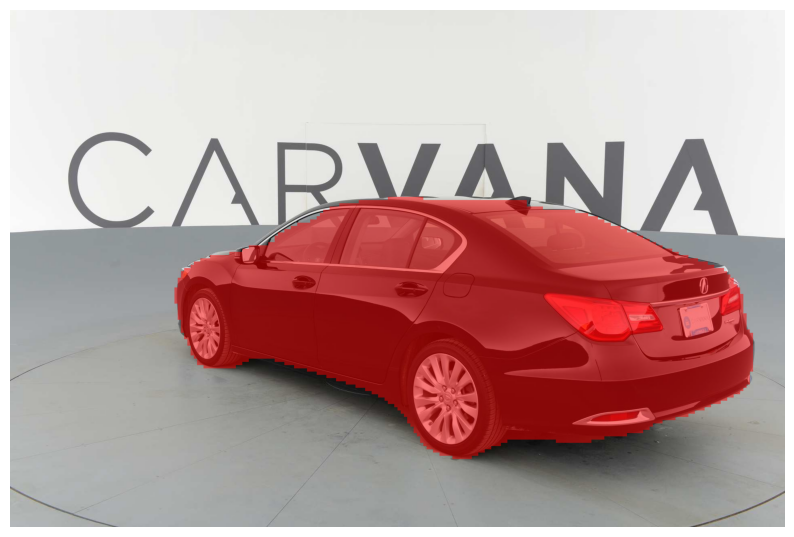

# Carvana-Segmentation-UNet

This repository contains an implementation of the UNet architecture for image segmentation tasks, specifically targeting binary segmentation. The code is designed to train a UNet model, evaluate its performance, and make predictions on new images.

## Table of Contents

1. [Overview](#overview)
2. [UNet Architecture](#unet-architecture)
3. [Dataset](#dataset)
4. [Repository Structure](#repository-structure)
5. [Setup and Installation](#setup-and-installation)
6. [Training the Model](#training-the-model)
7. [Inference and Making Predictions](#inference-and-making-predictions)
8. [Results](#results)
9. [References](#references)

## Overview

### What is UNet?

UNet is a convolutional neural network architecture primarily used for biomedical image segmentation. It was first introduced by Olaf Ronneberger et al. in their 2015 paper "U-Net: Convolutional Networks for Biomedical Image Segmentation". The key feature of UNet is its U-shaped architecture, consisting of a contracting path (encoder) and an expansive path (decoder), which makes it highly effective for precise localization and segmentation tasks.

### Use Cases

UNet is widely used in various fields, including:

- **Medical Imaging**: Segmentation of organs, tumors, and other structures in CT, MRI, and ultrasound images.
- **Satellite Image Analysis**: Land cover classification, road detection, and urban planning.
- **Autonomous Vehicles**: Identifying objects and boundaries on the road for navigation.
- **Agriculture**: Crop and soil segmentation from aerial or satellite images.

## UNet Architecture

Below is a visual representation of the UNet architecture:


The architecture consists of:

- **Contracting Path (Encoder)**: A sequence of convolutional layers followed by max pooling to downsample the input image, capturing the context.
- **Bottleneck**: The bottom of the U, where the feature maps are the smallest in spatial dimensions but have the deepest representation.
- **Expansive Path (Decoder)**: A sequence of transposed convolutions that upsample the feature maps and concatenate them with corresponding feature maps from the contracting path, allowing precise localization.

## Dataset

This project utilizes the [Carvana Image Masking Challenge](https://www.kaggle.com/c/carvana-image-masking-challenge/data) dataset, which is hosted on Kaggle. The dataset consists of high-resolution images of cars, along with corresponding binary masks that outline the car's silhouette.

### Dataset Details

- **Images**: The dataset contains 5,000 images of cars taken from various angles.
- **Masks**: Each image has an associated binary mask that highlights the car in the image. The masks are used as ground truth for training the segmentation model.
- **Challenge**: The goal is to accurately predict the car mask for each image, essentially segmenting the car from the background.

### Downloading the Dataset

1. Sign up or log in to Kaggle.
2. Visit the [Carvana Image Masking Challenge Dataset page](https://www.kaggle.com/c/carvana-image-masking-challenge/data).
3. Download the dataset and extract it into the `data/` directory of this repository, maintaining the structure:

```plain
data/
├── train_images/
├── train_masks/
├── val_images/
└── val_masks/
```

## Repository Structure

Here's a brief overview of the files in this repository:

- **`models.py`**: Contains the implementation of the UNet architecture.
- **`train.py`**: Script to train the UNet model on a given dataset.
- **`utils.py`**: Utility functions for saving/loading model checkpoints, calculating accuracy, and saving prediction images.
- **`config.py`**: Configuration file containing hyperparameters, file paths, and other settings.
- **`inference.py`** (to be created): Script for running inference on new images using a trained UNet model.

## Setup and Installation

1. **Clone the Repository:**

    ```bash
    git clone https://github.com/matin-ghorbani/Carvana-Segmentation-UNet
    cd Carvana-Segmentation-UNet
    ```

2. **Install the Required Packages:**
    Ensure you have Python 3.8+ and PyTorch installed. Install the dependencies using pip:

    ```bash
    pip install -r requirements.txt
    ```

## Training the Model

To train the model, run the train.py script. Make sure the dataset is correctly placed in the data/ directory as mentioned above.

```bash
python train.py
```

During training, the script will:

- Load the training and validation datasets.
- Train the UNet model for the specified number of epochs.
- Save the trained model checkpoints.
- Evaluate the model's performance on the validation set.
- Save sample predictions as images.

You can adjust the training parameters (e.g., learning rate, batch size, number of epochs) in the `config.py` file.

## Inference and Making Predictions

To run inference on a new image and overlay the prediction on the original image, use the `inference.py` script. Run the inference script:

```bash
python inference.py --model path/to/checkpoint.pth.tar --img path/to/your/image.jpg --save
```

You can download my weight from [here](https://drive.google.com/file/d/1WK-BsxPHHNNrnAgT6rga-nN1Ne5CTF64/view?usp=sharing)

## Results

I got these results after only 3 epochs

| **Test Image 1** | **Test Image 2** | **Test Image 3** |
|:----------------:|:----------------:|:----------------:|
|  |  |  |

| **Prediction 1** | **Prediction 2** | **Prediction 3** |
|:----------------:|:----------------:|:----------------:|
|  |  |  |

- Training loss: *0.0772*
- Testing accuracy: *0.9756*
- Testing dice score: *0.9455*

## References

- UNet Paper: [U-Net: Convolutional Networks for Biomedical Image Segmentation](https://arxiv.org/abs/1505.04597)
- Carvana Image Masking Challenge: [Kaggle Competition](https://www.kaggle.com/c/carvana-image-masking-challenge)
